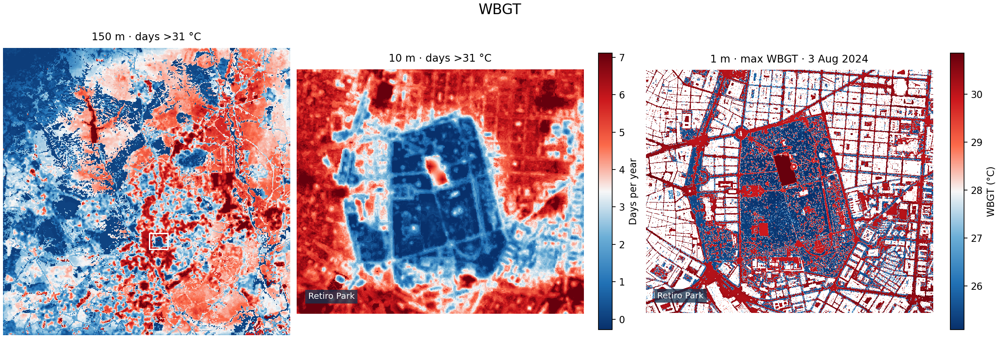
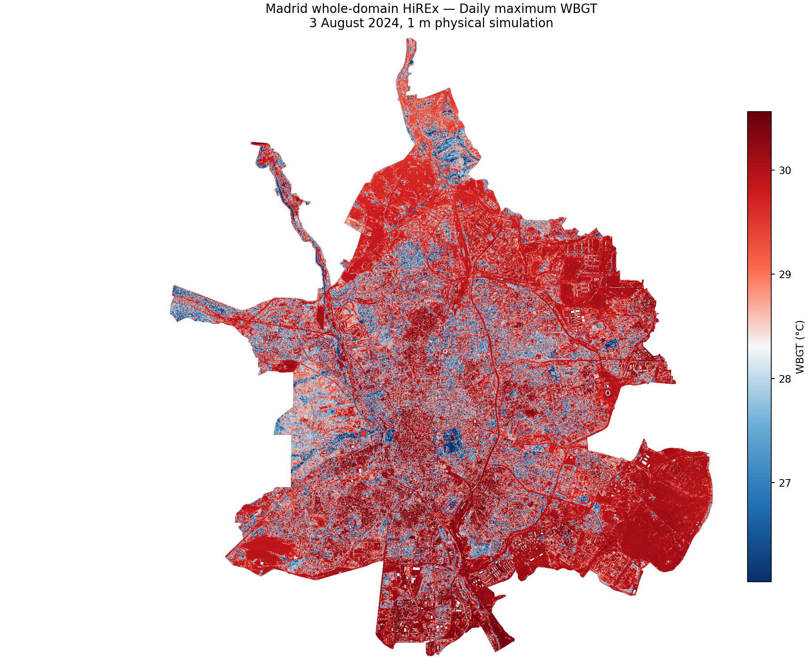
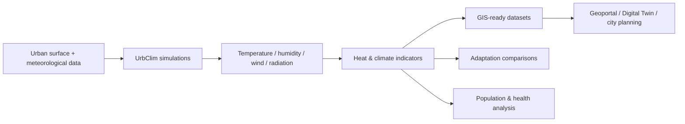

# UrbClim | URBREATH urban climate datasets

**Urban climate, heat-stress and adaptation datasets produced by VITO for city planning, GIS, geoportals and Digital Twin applications.**

## Goal

UrbClim is VITO's high-resolution urban climate model. In **URBREATH**, VITO runs UrbClim and turns the simulations into **ready-to-use geospatial datasets and indicators** for cities.

<table>
  <tr><td width="28%"><b>Provided by</b></td><td>VITO</td></tr>
  <tr><td><b>Main products</b></td><td>Urban heat, heat stress, UHI, climate indicators and adaptation scenarios</td></tr>
  <tr><td><b>Primary spatial scale</b></td><td>100 m UrbClim outputs, with finer products for selected applications</td></tr>
  <tr><td><b>Delivery</b></td><td>GIS-ready raster datasets and derived maps for URBREATH city workflows</td></tr>
  <tr><td><b>Data use</b></td><td>URBREATH data products released by VITO are free for everyone to use and reuse</td></tr>
  <tr><td><b>Model availability</b></td><td>UrbClim remains VITO intellectual property and is not distributed through this repository</td></tr>
</table>

---

## What is UrbClim?

UrbClim is VITO's urban boundary-layer climate model. It combines a land-surface scheme with a three-dimensional atmospheric boundary-layer representation and is designed for high-resolution urban climate simulations at city-scale.

Within URBREATH, the full model is not deployed as an interactive city tool. Instead, **VITO performs the simulations and provides the resulting datasets**, avoiding the computational burden of running the model locally.

## What data can be provided?

The exact package depends on the city, available local data and the application. Typical URBREATH products include:

| Category | Examples |
|---|---|
| **Urban climate** | Air temperature, humidity, wind and land-surface temperature |
| **Temperature indicators** | Mean temperature, daily maximum/minimum temperature, hot days, tropical nights |
| **Urban Heat Island** | Daytime and night-time UHI indicators |
| **Heat waves** | Heatwave days and Heat Wave Magnitude Index |
| **Heat stress** | WBGT and days/hours above relevant heat-stress thresholds |
| **Present & future climate** | Reference-climate and future-climate indicator maps |
| **Adaptation scenarios** | Trees, low vegetation, green roofs and other locally defined interventions |
| **Health/exposure products** | Population or health-oriented layers where suitable input data are available |

WBGT complements air temperature by representing the combined effects of **temperature, humidity, wind and radiation** on human heat stress.

## Spatial products

The **100 m UrbClim layers are the primary climate-analysis products**. Depending on the city package, VITO can also provide additional spatial detail for communication and local planning.

Typical products include:

- **100 m**: UrbClim climate variables and indicator layers;
- **10 m**: statistically downscaled indicator maps for detailed city-scale visualisation;
- **1 m** :**HighREx** Our very high resolution physical model can produce WBGT maps for selected extreme hot days where detailed local data are available.

The map below shows example at different resolutions for Madrid.

## Adaptation analysis

UrbClim can be used to compare a reference city with adaptation scenarios. Depending on the local application, scenarios can include additional tree cover, low vegetation, green roofs, changes in building characteristics, or other locally relevant measures.

Outputs can be delivered as:

**baseline → adapted condition → adaptation effect**

This makes it possible to identify where proposed measures have the strongest influence on urban heat and heat stress.

## City examples

The Madrid package illustrates the range of spatial products that can be prepared from the URBREATH urban-climate workflow. It includes climate-period heat indicators, present/future layers with associated adaptation scenarios, and detailed WBGT maps.

The products are designed for municipal GIS and geoportal use: identifying heat hotspots, comparing neighbourhoods, assessing future conditions and supporting adaptation planning.

## Typical workflow

Typical inputs include ERA5 meteorology, future climate projections, land cover, imperviousness, building height, vegetation information, digital elevation data and local city datasets where available.

## Data access

URBREATH UrbClim outputs are distributed as **city-specific data packages**. 

For background on VITO's urban climate services, visit [VITO Climate Services](https://climasys.vito.be/en).

## Data use and intellectual property

**UrbClim is developed and owned by VITO**. The model, its source code and associated software are not distributed through this repository.

**Data products released by VITO during the URBREATH project are free for everyone to use and reuse.** This applies to released UrbClim-derived raster datasets, indicators, maps and adaptation-scenario layers.

When reusing the data, please acknowledge **VITO** and **URBREATH**.

## References

- De Ridder, K., Lauwaet, D., & Maiheu, B. (2015). **UrbClim: A fast urban boundary layer climate model.** *Urban Climate, 12*, 21–48. [https://doi.org/10.1016/j.uclim.2015.01.001](https://doi.org/10.1016/j.uclim.2015.01.001)

- Lauwaet, D., Maiheu, B., De Ridder, K., Boënne, W., Hooyberghs, H., Demuzere, M., & Verdonck, M. L. (2020). **A new method to assess fine-scale outdoor thermal comfort for urban agglomerations.** *Geoscientific Model Development, 13*(11), 5517–5539. [https://doi.org/10.5194/gmd-13-5517-2020](https://doi.org/10.5194/gmd-13-5517-2020)

- Hellebosch, I., Souverijns, N., Top, S., Lauwaet, D., Caluwaerts, S., & De Ridder, K. (2026). **Modeling outdoor heat stress at meter-scale resolution: Validation of the UrbClim-HiREx framework.** *Urban Climate, 43*, 101684. [https://doi.org/10.1016/j.uclim.2024.101684](https://doi.org/10.1016/j.uclim.2024.101684)

- Souverijns, N., Lauwaet, D., Capela Lourenço, T., Gomes Marques, I., Saeed, F., Saleh Khan, M., Irfan, K., Georgiou, S., Davidel, R., De Paep, M., Hermand, S., Kropf, C. M., Yeung, K. L., Lejeune, Q., & Schleussner, C.-F. (2024). **Mapping present-day and future urban heat-related health risks for 142 European cities.** *Environmental Research: Climate, 3*, 015004. [https://doi.org/10.1088/2752-5295/ad7234](https://doi.org/10.1088/2752-5295/ad7234)

- Souverijns, N., Lauwaet, D., Lejeune, Q., Kropf, C. M., Yeung, K. L., Nath, S., & Schleussner, C.-F. (2026). **100 m climate and heat stress data up to 2100 for 142 cities around the globe.** *Scientific Data, 13*, 215. [https://doi.org/10.1038/s41597-024-03661-9](https://doi.org/10.1038/s41597-024-03661-9)

For more references visit [VITO Climate Services portfolio](https://climasys.vito.be/en/portfolio/publications)
